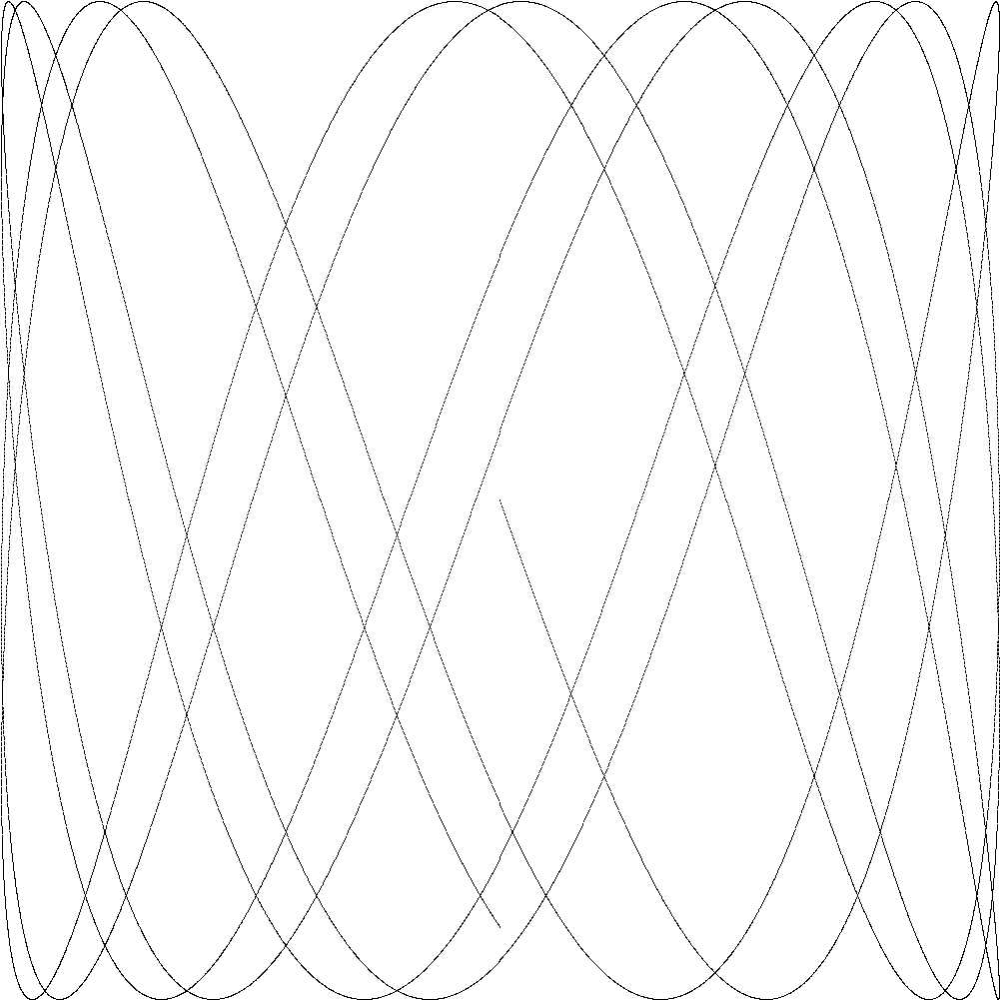

## 📈 Learning Progress
| Milestone | Status | Key Deliverables |
| :--- | :--- | :--- |
| **01: 1.1. Hello, World** | ✅ Completed | Compiled code using package main and fmt.
| **02: 1.2. Command-Line Arguments** | 🏗️ In Progress | Processing terminal input with os.Args and for range
| **03: 1.3. Finding Duplicate Lines** | 🏗️ In Progress | Goroutines & Channels 
| **04: 1.4. Animated GIFs** | ✅ Completed | 
